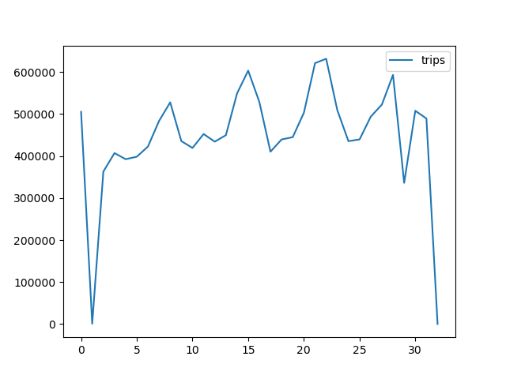

# Apache Spark 사용기
- data 폴더는 데이터들을 담기 위해서 사용하려고한다.
- 데이터 분석에 필요한 데이터는 상대적으로 큰 데이터가 많기때문에 `.gitignore`처리하려고한다
## 개발환경
- MacOS M1
- Python 3.9 (Conda)
- Java 1.8
- PySpark 3.2.1

## 환경 설청 및 설치
- 개발환경 세팅하기
    - java 설치
        ```shell
        brew install adoptopenjdk8
        ```
    - python 설치
        ```shell
        brew install python
        ```
        - 혹은, [아나콘다](https://www.anaconda.com/products/distribution)에서 설치해도 된다
    - pySpark 설치
        ```shell
        pip install pyspark
        ```
        - pySpark 실행 확인하기
            ```shell
            pyspark
            ```
    - parquet 데이터 dependency 설치
        ```shell
        pip install pyarrow fastparquet
        ```
    - 데이터 가져오기
        - 미국에서 제공하는 trip data
        ```
        https://www1.nyc.gov/site/tlc/about/tlc-trip-record-data.page
        ```

## 데이터 변환하기
- parquet데이터를 받게 된다. parquet도 상관은 없지만 좀 더 익숙한 csv파일로 변환해서 다루려고한다

### parquet to csv
```python
import pandas as pd

df = pd.DataFrame()
df.to_parquet("trip_data.parquet", compression="gzip")

df = pd.read_parquet("./fhvhv_tripdata_2022-01.parquet")
df.to_csv("trip_data.csv")
```

### csv 속성 확인하기
- 데이터 분석을 위해서는 어떤 데이터를 어떻게 분석할지가 중요한데 이 부분 파악을 위해서는 데이터 속성들을 알아야한다
- python pandas에는 데이터를 간략하게 볼 수 있는 기능이있다
    ```python3
    import pandas as pd

    df = pd.read_csv("./trip_data.csv")
    print(df.head(5))
    ```
- 위의 코드를 실행시키면 헤드라인과 그와 관련된 데이터셋 5줄이 출력된다
    
    ```
    Unnamed: 0 hvfhs_license_num dispatching_base_num originating_base_num     request_datetime  ... shared_request_flag shared_match_flag access_a_ride_flag  wav_request_flag  wav_match_flag
    0           0            HV0003               B03404               B03404  2022-01-01 00:05:31  ...                   N                 N                                    N               N
    1           1            HV0003               B03404               B03404  2022-01-01 00:19:27  ...                   N                 N                                    N               N
    2           2            HV0003               B03404               B03404  2022-01-01 00:43:53  ...                   N                 N                                    N               N
    3           3            HV0003               B03404               B03404  2022-01-01 00:15:36  ...                   N                 N                                    N               N
    4           4            HV0003               B03404               B03404  2022-01-01 00:25:45  ...                   N                 N                                    N               N
    ```
    - 여기서 필요한건 날짜이기때문에 5번째 컬럼을 파악한다고 생각하고 분석코드를 작성한다

## Spark 사용하기
- 위의 내용을 잘 실행했다면, Spark를 잘 다운받고 pyspark도 잘 실행이 되는 상황이다

### Spark Job 작성하기 - Uber 트립 수 확인하기
```python
# count_trips.py
# Spark Package 가져오기
from pyspark import SparkConf, SparkContext

# Pandas 패키지 가져오기
import pandas as pd

# 스파크 설정하기
conf = SparkConf().setMaster("local").setAppName("My First Test App")
sc = SparkContext(conf=conf)

# 데이터 디렉토리
direct = "/Users/wool/Develop/Github/data-flow-framework/apache-spark-starter/data"
filename = "trip_data.csv"

# data parse
lines = sc.textFile(f"file:///{direct}/{filename}")
header = lines.first()
filtered_lines = lines.filter(lambda row: row != header)

# 필요한 부분 추출
dates = filtered_lines.map(lambda x: x.split(",")[4].split(" ")[0])
result = dates.countByValue()

# csv로 결과값 저장
pd.Series(result, name="trips").to_csv(f"{direct}/result_data/result_trips_data.csv")

```
- direct 는 나의 컴퓨터에 맞게 작성했다
- data폴더에있는 trip_data.csv를 읽어서, data폴더 하위의 result_data폴더에 `result_trips_data.csv`로 저장한다
- job 실행은 `spark-submit`으로 실행한다
    ```shell
    $ spark-submit count_trips.py
    ```
- job 실행중에는 `http://{host}:4040/jobs`에서 스파크 잡 실행을 확인해 볼 수 있다

### Uber 트립 수 결과 확인하기 - result_trips_data.csv 
- result_trips_data.csv를 읽어서 확인한다
    ```python
    # count_trips_visualize.py
    import pandas as pd
    import matplotlib.pyplot as plt


    trips = pd.read_csv("../data/result_data/result_trips_data.csv")
    trips.plot()
    plt.show()
    ```
    